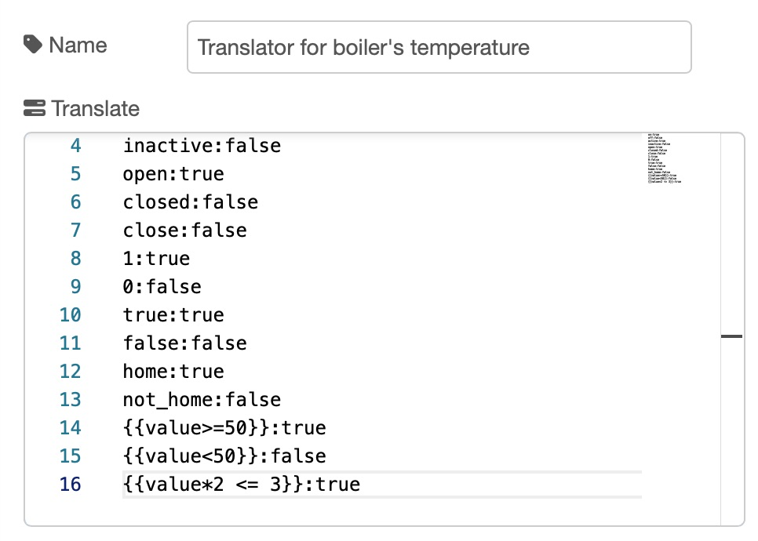

 

[![NPM version][npm-version-image]][npm-url]

[![NPM downloads per month][npm-downloads-month-image]][npm-url]

[![NPM downloads total][npm-downloads-total-image]][npm-url]

[![MIT License][license-image]][license-url]

[](https://standardjs.com)

[](https://www.paypal.me/techtoday)

[![youtube][youtube-image]][youtube-url]  

A set of Node-RED enhanced boolean logic and utility nodes, with persistent values after reboot. Compatible also with Homeassistant values. 

<br/>
<br/>

## CHANGELOG

- See <a href="https://github.com/Supergiovane/node-red-contrib-boolean-logic-ultimate/blob/master/CHANGELOG.md">here the changelog</a>

<br/>
<br/>

# TRANSLATOR NODE

Other than true/false, all nodes accepts [Homeassistant](https://www.home-assistant.io) output strings.  

You can **even add your own input translation word list**, thanks to the translator-config node.

The translator node can translate an input payload, to a true/false boolean values.<br />

Each row in the text box, represents a translation command. <br/>

There are some default translation's rows, to make the *boolean-logic-ultimate* nodes compatible with Homeassistant as default. <br/>

You can add your own translation row.<br/>

|           | Description                                                                                          |
| --------- | ---------------------------------------------------------------------------------------------------- |
| Translate | Add, delete or edit your own translation command. The row's translation command must be **input string:true(or false)**. For example: <code>open:true</code> <code>closed:false</code>. You can also use an expressions to be evaluated, like this <code>{{value>=50}}:true</code> and <code>{{value<50}}:false</code>. In this case, the tranlsator will evaluate (javascript eval) the expression and, if true, returns the choosen value. |



The node can convert arbitrary input values to true/false. It supports Homeassistant string to boolean conversion as well. For enabling auto conversion, please be sure to disable **Reject non boolean (true/false) input values** <br/>

### NODE CONFIGURATION

| Property                                     | Description                                                                                          |
| -------------------------------------------- | ---------------------------------------------------------------------------------------------------- |
| Inputs count                                 | Set the number of different topics to be evaluated. The node will output a message to the flow, after this number of *different* topics arrives. *Remember: each input topic must be different. For example, if you set this field to 3, the node expects 3 different topics.* |
| Evaluate                                     | It's the msg property to be evaluated. *By default, it is "payload", but you can also specify other properties, for example "payload.value"* |
| Filter output                                | **Output both 'true' and 'false'** results: Standard behaviour, the node will output <b>true</b> and <b>false</b> whenever it receives an input and calculate the boolean logics as output. **Output only 'true'** results: whenever the node receives an input, it outputs a payload <b>true</b> only if the result of the logic is true. <b>False</b> results are filtered out. |
| Trigger mode                                 | **All topics**: standard behaviour, the node will evaluate each input topic and ouputs the values. At each input change, it will output a msg on the flow. **Single topic + eval other inputs**: the node evaluates all the input topics, but only whenever it receives a msg input with the **specified topic**, it  outputs a msg to the flow. |
| If input states are undefined                | Every time you create a node or modify the node, all inputs are set to undefined. This means that the node will wait the arrive of all topics (for example 3 topics, if you've selected 3 topics in the option), before it can output a payload. This can be a problem if your logic must be operative as soon as you deploy the flow. To overcome this problem, you can "initialize" all the undefined inputs with True or False. **Leave undefined**: Standard behaviour, the node will wait all the "undefined" topics to arrive, then starts a flow with the result. **True or False**: The node is immediately operative, by force the initialization of the "undefined" inputs with "true" or "false". |
| Remember latest input values after reboot    | If checked, the input values are retained after a node-red reboot. That means, that if you reboot your node-red, you don't need to wait all inputs to arrive and initialize the node, before the node can output a payload. Every time you modify the node's config, <b>the retained values are cleared</b>. |
| Reject non boolean (true/false) input values | If checked, the node will accept only boolean true/false values. Otherwise, it will try to convert the payload value to a logic true/false boolean. |
| Delay evaluation (ms)                        | Delays the evaluation until this time (in milliseconds) is elapsed. Each time a message or "topic trigger message" (see **Trigger mode**) arrives, the delay is restarted. This option is useful for debouncing pourposes or simply for adding some delay. For example, you can turn on a light if the room is occupied for a long time, allowing people to fast transit repeatedly, without the need of turning the light on. Another example, if you have many sensors changing state rapidly, you can wait until these sensor reach a quiet state, then evaluate the inputs. |

<br/>

**INPUT MSG TO THE NODE**

| Input msg        | Description                                                                                          |
| ---------------- | ---------------------------------------------------------------------------------------------------- |
| msg.reset = true | Resets all saved input values to undefined                                                           |
| msg.inputcount   | Changes the inputs count property. For example, <b>msg.inputcount = 3</b> Whenever you lower the inputcount from a higher number to a lower one, for example from 3 to 2, it's suggested to do a <b>msg.reset=true</b> to reset all stored input values. |

<br/>
<br/>
<br/>
<br/>
<br/>

# INTERRUPT FLOWS ULTIMATE

The interrupt flows is able to stop the input messages to exiting the node.

### NODE CONFIGURATION

| Property         | Description                                                                                          |
| ---------------- | ---------------------------------------------------------------------------------------------------- |
| Trigger by topic | Whenever the node receives a payload = false from this topic,it stops output messages to the flow. As soon it receives payload = true from this topic, the output messages start to flow out again. The node will output the current stored message plus an added property "isReplay = true", as soon as it receives a ***msg.play = true*** from this topic. The node will clear the current stored message, as soon as it receives a ***msg.reset = true*** from this topic. |
| With Input       | It's the msg property to be evaluated. *By default, it is "payload", but you can also specify other properties, for example "payload.value"* |
| Then             | This property, allow you to auto toggle the selected start state (pass or block) after a timer has elapsed. You can choose from some pre-defined delays. If you have, for example, an Homekit-Bridged nodeset with a thermostat node or security system node in your flow, once node-red restarts, these homekit nodes output a default message to the flow. Just put an InterruptFlow node with a "block at start" behaviour and a toggle delay enabled behind homekit nodes, to temporary stop the chained nodes to receive the unwanted startup message. |

<br/>

**INPUT MSG WITH "TRIGGER" TOPIC**

Pass <code>msg.payload = true</code> to allow messages to pass through</br>

Pass <code>msg.payload = false</code> to prevent messages from passing through</br>

Pass <code>msg.play = true</code> from a message having the "trigger" topic, to replay the last stored message</br>

Pass <code>msg.reset = true</code> from a message having the "trigger" topic, to clear the last stored message</br>

<code>
// Assume you set the "trigger by topic" field to "trigger" 
// This code replays the last message and adds the property msg.isReplay = true to the output message.
msg.topic = "trigger"
msg.play = true;
</code>

<code>
// Assume you set the "trigger by topic" field to "trigger" 
// This code clears the last stored message
msg.topic = "trigger"
msg.reset = true;
</code>

</br>

See the example below.<br/>


<details><summary>CLICK HERE, copy and paste it into your flow</summary>
<code>
[{"id":"1fd91f1f.c1fae9","type":"InterruptFlowUltimate","z":"96f56ceb91657677","name":"Interrupt Flow","triggertopic":"IsNight","initializewith":"1","autoToggle":"0","x":420,"y":200,"wires":[["b9844c7f.0f306"]]},{"id":"eaa32462.398808","type":"comment","z":"96f56ceb91657677","name":"Motion sensor to switch on stairs light, only if it's night, using flow interruption","info":"","x":350,"y":160,"wires":[]},{"id":"10787f38.edfe81","type":"inject","z":"96f56ceb91657677","name":"","repeat":"","crontab":"","once":false,"onceDelay":0.1,"topic":"IsNight","payload":"true","payloadType":"bool","x":170,"y":300,"wires":[["1fd91f1f.c1fae9"]]},{"id":"a6092a15.1c592","type":"inject","z":"96f56ceb91657677","name":"","repeat":"","crontab":"","once":false,"onceDelay":0.1,"topic":"IsNight","payload":"false","payloadType":"bool","x":170,"y":340,"wires":[["1fd91f1f.c1fae9"]]},{"id":"21ba9c30.02abbc","type":"comment","z":"96f56ceb91657677","name":"Brightness sensor","info":"","x":170,"y":260,"wires":[]},{"id":"af131ae5.a1bfb8","type":"inject","z":"96f56ceb91657677","name":"","props":[{"p":"payload"},{"p":"topic","vt":"str"}],"repeat":"","crontab":"","once":false,"onceDelay":0.1,"topic":"MotionSensor","payload":"true","payloadType":"bool","x":190,"y":200,"wires":[["1fd91f1f.c1fae9"]]},{"id":"b9844c7f.0f306","type":"debug","z":"96f56ceb91657677","name":"Temporized Stairs Lightbulb","active":true,"tosidebar":true,"console":false,"tostatus":false,"complete":"payload","targetType":"msg","x":660,"y":200,"wires":[]},{"id":"a5305f8bef578897","type":"comment","z":"96f56ceb91657677","name":"Temporary stop the flow, with Toggle","info":"","x":220,"y":440,"wires":[]},{"id":"ffc9d3b9d17bc07b","type":"InterruptFlowUltimate","z":"96f56ceb91657677","name":"Interrupt Flow with toggle","triggertopic":"trigger","initializewith":"0","autoToggle":"20","x":400,"y":480,"wires":[["14a72f83f29bb347"]]},{"id":"398548646f66c457","type":"inject","z":"96f56ceb91657677","name":"","props":[{"p":"payload"},{"p":"topic","vt":"str"}],"repeat":"1","crontab":"","once":true,"onceDelay":0.1,"topic":"","payloadType":"date","x":170,"y":480,"wires":[["ffc9d3b9d17bc07b"]]},{"id":"14a72f83f29bb347","type":"debug","z":"96f56ceb91657677","name":"","active":true,"tosidebar":true,"console":false,"tostatus":false,"complete":"false","statusVal":"","statusType":"auto","x":630,"y":480,"wires":[]}]
</code>
</details>

<br/>

In this other example, you can see the property "play" in action. This property allow you to replay the last previously stored message.<br/>

This allow to save the state of a node and then replay it back whenever you want.<br/>


<details><summary>CLICK HERE, copy and paste it into your flow</summary>
<code>
[{"id":"9839dd47.81b2c8","type":"InterruptFlowUltimate","z":"1337569a6adbb2e3","name":"Interrupt Flow","triggertopic":"trigger","initializewith":"1","autoToggle":"0","x":580,"y":300,"wires":[["d371d690.1e2fe8"]]},{"id":"568deb73.394fb4","type":"comment","z":"1337569a6adbb2e3","name":"1) Push buttons to change values","info":"","x":190,"y":140,"wires":[]},{"id":"e1c9f10a.0ba518","type":"inject","z":"1337569a6adbb2e3","name":"ALLOW","repeat":"","crontab":"","once":false,"onceDelay":0.1,"topic":"trigger","payload":"true","payloadType":"bool","x":130,"y":360,"wires":[["9839dd47.81b2c8"]]},{"id":"82ba24f9.0f0bd8","type":"inject","z":"1337569a6adbb2e3","name":"INTERRUPT","repeat":"","crontab":"","once":false,"onceDelay":0.1,"topic":"trigger","payload":"false","payloadType":"bool","x":150,"y":320,"wires":[["9839dd47.81b2c8"]]},{"id":"23ba4f9c.86de9","type":"comment","z":"1337569a6adbb2e3","name":"2) Push INTERRUPT, then try again to change value (1)","info":"","x":260,"y":280,"wires":[]},{"id":"24671ef2.4519e2","type":"inject","z":"1337569a6adbb2e3","name":"","repeat":"","crontab":"","once":false,"onceDelay":0.1,"topic":"","payload":"true","payloadType":"bool","x":130,"y":180,"wires":[["9839dd47.81b2c8"]]},{"id":"d371d690.1e2fe8","type":"debug","z":"1337569a6adbb2e3","name":"Debug","active":true,"tosidebar":true,"console":false,"tostatus":false,"complete":"payload","targetType":"msg","x":750,"y":300,"wires":[]},{"id":"409ec415.735d74","type":"inject","z":"1337569a6adbb2e3","name":"REPLAY","repeat":"","crontab":"","once":false,"onceDelay":0.1,"topic":"trigger","payload":"","payloadType":"str","x":140,"y":460,"wires":[["6653ed0.7186014"]]},{"id":"6653ed0.7186014","type":"change","z":"1337569a6adbb2e3","name":"Play","rules":[{"t":"set","p":"play","pt":"msg","to":"true","tot":"bool"}],"action":"","property":"","from":"","to":"","reg":false,"x":270,"y":460,"wires":[["9839dd47.81b2c8"]]},{"id":"e957a069.0ac458","type":"inject","z":"1337569a6adbb2e3","name":"","repeat":"","crontab":"","once":false,"onceDelay":0.1,"topic":"","payload":"false","payloadType":"bool","x":130,"y":220,"wires":[["9839dd47.81b2c8"]]},{"id":"8f0af608.8fb45","type":"comment","z":"1337569a6adbb2e3","name":"3) Replay last message stored by the node","info":"","x":220,"y":420,"wires":[]},{"id":"46e6f455.0023ac","type":"comment","z":"1337569a6adbb2e3","name":"You can use Interruptflow, to save the state of a node, and then replay the last state as you want.","info":"","x":390,"y":100,"wires":[]}]
</code>
</details>

<br/>
<br/>
<br/>
<br/>
<br/>

# INVERT ULTIMATE

Outputs the inverted input. For example true -> false<br />

The input message is preserved and passed to the output, changing only the topic and the payload. If the input message has it's own topic, it'll be preserved as well.<br/>

### NODE CONFIGURATION

| Property | Description                                                                                          |
| -------- | ---------------------------------------------------------------------------------------------------- |
| Input    | It's the msg property to be evaluated. *By default, it is "payload", but you can also specify other properties, for example "payload.value"* |

<br/>

<br/>
<br/>
<br/>
<br/>
<br/>

# FILTER ULTIMATE

This node has 2 outputs.<br />

If the input payload is true, the node will send <code>true</code> on output 1 and nothing on output 2<br />

If the input payload is false, the node will send nothing on output 1 and <code>false</code> on output 2<br />

The input message is preserved and passed to the output, changing only the topic and the payload. If the input message has it's own topic, it'll be preserved as well.<br/>

### NODE CONFIGURATION

| Property | Description                                                                                          |
| -------- | ---------------------------------------------------------------------------------------------------- |
| Input    | It's the msg property to be evaluated. *By default, it is "payload", but you can also specify other properties, for example "payload.value"* |

<br/>

<br/>
<br/>
<br/>
<br/>
<br/>

# BLINKER ULTIMATE

The pourpose of this node is to blink a led or something.<br />

output1 : outputs the value true/false<br/>

output2 : outputs the inverted value false/true<br/>

<br/>

### NODE CONFIGURATION

| Property | Description                                                                                          |
| -------- | ---------------------------------------------------------------------------------------------------- |
| Input    | It's the msg property to be evaluated. *By default, it is "payload", but you can also specify other properties, for example "payload.value"* |

<br/>

Pass <code>msg.payload = true</code> to start blinking</br>

Pass <code>msg.payload = false</code> to stop blinking</br>

Pass <code>msg.interval = 2000</code> to change the blinking interval</br>

- output1 stop behavior : when the blinker receives the stop message, you can select the behavior of the output1<br/>
- output2 stop behavior : when the blinker receives the stop message, you can select the behavior of the output2<br/>


<details><summary>CLICK HERE, copy and paste it into your flow</summary>
<code>
[{"id":"33d76f42.58e088","type":"BlinkerUltimate","z":"c3456bd7.8ee9d8","name":"Blinker","blinkfrequency":"500","x":260,"y":340,"wires":[["ad7488b.2a1d9f8"]]},{"id":"ac0d404f.70cc","type":"inject","z":"c3456bd7.8ee9d8","name":"","topic":"","payload":"true","payloadType":"bool","repeat":"","crontab":"","once":false,"onceDelay":0.1,"x":90,"y":320,"wires":[["33d76f42.58e088"]]},{"id":"bfdc64c6.06e2d","type":"inject","z":"c3456bd7.8ee9d8","name":"","topic":"","payload":"false","payloadType":"bool","repeat":"","crontab":"","once":false,"onceDelay":0.1,"x":90,"y":360,"wires":[["33d76f42.58e088"]]},{"id":"ad7488b.2a1d9f8","type":"debug","z":"c3456bd7.8ee9d8","name":"Led","active":true,"tosidebar":true,"console":false,"tostatus":false,"complete":"payload","targetType":"msg","x":410,"y":340,"wires":[]},{"id":"865e29f9.4d1e98","type":"comment","z":"c3456bd7.8ee9d8","name":"Blink a signalling led","info":"","x":110,"y":280,"wires":[]}]
</code>
</details>

<br/>
<br/>
<br/>
<br/>
<br/>

# SIMPLE OUTPUT ULTIMATE

The pourpose of this node is to send a message with payload TRUE on the first output and FALSE on second output, independently from the msg input.<br />

This is useful if you need to simply send a true or false payload.

### NODE CONFIGURATION

| Property | Description                                                                                          |
| -------- | ---------------------------------------------------------------------------------------------------- |
| Input    | It's the msg property to be evaluated. *By default, it is "payload", but you can also specify other properties, for example "payload.value"* |

<br/>


<details><summary>CLICK HERE, copy and paste it into your flow</summary>
<code>
[{"id":"e1149e22.c9b298","type":"inject","z":"81a64dae.012c18","name":"","topic":"","payload":"","payloadType":"date","repeat":"","crontab":"","once":false,"onceDelay":0.1,"x":100,"y":820,"wires":[["6a419c72.5a4e7c"]]},{"id":"6a419c72.5a4e7c","type":"SimpleOutputUltimate","z":"81a64dae.012c18","name":"T/F","x":290,"y":820,"wires":[["8ba3f611.26beb8"],["b469193b.950598"]]},{"id":"8ba3f611.26beb8","type":"debug","z":"81a64dae.012c18","name":"","active":true,"tosidebar":true,"console":false,"tostatus":false,"complete":"true","targetType":"full","x":530,"y":800,"wires":[]},{"id":"b469193b.950598","type":"debug","z":"81a64dae.012c18","name":"","active":true,"tosidebar":true,"console":false,"tostatus":false,"complete":"true","targetType":"full","x":530,"y":840,"wires":[]},{"id":"2451f593.04e62a","type":"comment","z":"81a64dae.012c18","name":"Whatever the input is, output msg with payload TRUE on first and FALSE on second output.","info":"","x":330,"y":760,"wires":[]}]
</code>
</details>

<br/>
<br/>
<br/>
<br/>
<br/>

# INJECT ULTIMATE

The pourpose of this node is to send a message with payload TRUE on the first output, FALSE on second output and a TOGGLE (true/false) on the third output, by pressing the pushbutton.<br />

This is useful if you need to simply test your flow. 


<details><summary>CLICK HERE, copy and paste it into your flow</summary>
<code>
[{"id":"13faaec9.cd80b9","type":"InjectUltimate","z":"81a64dae.012c18","name":"True","x":110,"y":1000,"wires":[["6557d19.c71abb"],[],[]]},{"id":"6557d19.c71abb","type":"debug","z":"81a64dae.012c18","name":"","active":true,"tosidebar":true,"console":false,"tostatus":false,"complete":"false","x":370,"y":1080,"wires":[]},{"id":"569b3820.b056e8","type":"InjectUltimate","z":"81a64dae.012c18","name":"False","x":110,"y":1080,"wires":[[],["6557d19.c71abb"],[]]},{"id":"189399f.c384f66","type":"InjectUltimate","z":"81a64dae.012c18","name":"Toggle","x":110,"y":1160,"wires":[[],[],["6557d19.c71abb"]]},{"id":"56119644.8c4bf8","type":"comment","z":"81a64dae.012c18","name":"Inject Ultimate. Simple and efficient.","info":"","x":180,"y":940,"wires":[]}]
</code>
</details>

<br/>
<br/>
<br/>
<br/>
<br/>

# STATUS ULTIMATE

The pourpose of this node is to show a status of the passingthrough message.<br />

**Show msg.**

- Write here the property you want to get the status from. For example, "payload", "mycar.color", etc.


<details><summary>CLICK HERE, copy and paste it into your flow</summary>
<code>
[{"id":"8c1648bf.58e6","type":"StatusUltimate","z":"5c2de561.6a0de4","name":"Status","property":"testobject.color","x":90,"y":180,"wires":[["b96cd259.3f8398"]]},{"id":"3beb9c6.90d1e64","type":"function","z":"5c2de561.6a0de4","name":"Dummy msg","func":"msg.payload = \"The payload is \" + msg.payload;\nmsg.myproperty = \"This is my custom property\";\nmsg.testobject = {len : 100, color : \"blue\"};\nreturn msg;","outputs":1,"noerr":0,"initialize":"","finalize":"","libs":[],"x":230,"y":100,"wires":[["8c1648bf.58e6"]]},{"id":"84080b79.df3f38","type":"debug","z":"5c2de561.6a0de4","name":"","active":true,"tosidebar":true,"console":false,"tostatus":false,"complete":"true","targetType":"full","statusVal":"","statusType":"auto","x":710,"y":180,"wires":[]},{"id":"b534d2ec.635398","type":"InjectUltimate","z":"5c2de561.6a0de4","name":"Inject","topic":"1","curVal":true,"x":90,"y":100,"wires":[[],[],["3beb9c6.90d1e64"]]},{"id":"9745c77a.0361b","type":"comment","z":"5c2de561.6a0de4","name":"View the status of a message passing through the StatusUltimate node","info":"","x":270,"y":40,"wires":[]},{"id":"b96cd259.3f8398","type":"StatusUltimate","z":"5c2de561.6a0de4","name":"Status","property":"payload","x":230,"y":180,"wires":[["ac2b784b.b44a48"]]},{"id":"ac2b784b.b44a48","type":"StatusUltimate","z":"5c2de561.6a0de4","name":"Status","property":"myproperty","x":450,"y":180,"wires":[["84080b79.df3f38"]]}]
</code>
</details>
<br/>
<br/>
<br/>
<br/>
<br/>

# IMPULSE ULTIMATE

The pourpose of this node is to send a sequence of pulsed commands to for example, open a garage door or to command an appliance requiring a set of timed commands.<br />


<details><summary>CLICK HERE, copy and paste it into your flow</summary>
<code>
[{"id":"6fc25e59990d5955","type":"ImpulseUltimate","z":"5ed79f4a958a1f20","name":"Turn on the fan at level 1","commandText":"// Turn on the fan (must be sent as first command ever\n// even if the fan is already off)\nsend:true\nwait:300\nsend:false\nwait:3000\n// Reset the fan\nsend:true\nwait:2000\nsend:false\nwait:3000\n// Speed 1\nsend:true\nwait:300\nsend:false","x":410,"y":140,"wires":[["7a2ea180e17e513c"]]},{"id":"0d7de5c606ecaf92","type":"InjectUltimate","z":"5ed79f4a958a1f20","name":"START THE FAN","topic":"1","curVal":true,"x":130,"y":120,"wires":[["6fc25e59990d5955"],[],[]]},{"id":"7a2ea180e17e513c","type":"debug","z":"5ed79f4a958a1f20","name":"","active":true,"tosidebar":true,"console":false,"tostatus":false,"complete":"true","targetType":"full","statusVal":"","statusType":"auto","x":620,"y":140,"wires":[]},{"id":"333733dffda4dc56","type":"InjectUltimate","z":"5ed79f4a958a1f20","name":"BLOCK SCRIPT","topic":"1","curVal":true,"x":130,"y":200,"wires":[[],["6fc25e59990d5955"],[]]},{"id":"cdae7e4bc0835e4f","type":"comment","z":"5ed79f4a958a1f20","name":"This example turns on a \"LucePlan Blow\" fan and set it's speed to 1","info":"","x":260,"y":60,"wires":[]}]
</code>
</details>

### NODE CONFIGURATION

| Property | Description                                                                                          |
| -------- | ---------------------------------------------------------------------------------------------------- |
| Input    | It's the msg property to be evaluated. *By default, it is "payload", but you can also specify other properties, for example "payload.value"* |

<br/>

**Avaiable Commands**<br />

Commands are to be wrote in the format: command:value. For example ***send:200***, ***wait:2000***. Each row represents a command.<br />

<br /><b>send</b><br />
sends a value. For example: ***send:true*** or ***send:100*** or ***send:Hello***<br />
<br /><b>wait</b><br />
wait for specified time (in milliseconds). For example ***wait:500*** waits for 500 milliseconds<br />
<br /><b>restart</b><br />
Restart the sequence from the beginning. Use ***restart*** alone, without **:** and extra value. For example ***restart*** <br />
<br /><b>//</b><br />
comment. For example: ***// This opens the garage***. The comment are ignored, so you can write what you want.<br />
<br />

Pass <code>msg.payload = true</code> to the node to start the sequence</br>

Pass <code>msg.payload = false</code> to the node to stop the running sequence</br>

<br />

- Output: the node outputs a message you specified in the command textbox<br/>

<br/>
<br/>
<br/>
<br/>
<br/>

# MATH ULTIMATE

The pourpose of this node is to do maths on the incoming values. Each incoming message MUST HAVE OWN TOPIC.<br />


<details><summary>CLICK HERE, copy and paste it into your flow</summary>
<code>
[{"id":"05b6ce0cb476abd5","type":"SumUltimate","z":"2bf641f4b8742755","name":"Multiply","property":"payload","math":"multiply","x":400,"y":180,"wires":[["567aa6a9719e463e"]]},{"id":"6744e01b88d820b9","type":"inject","z":"2bf641f4b8742755","name":"","props":[{"p":"payload"},{"p":"topic","vt":"str"}],"repeat":"","crontab":"","once":false,"onceDelay":0.1,"topic":"Wh Washing machine","payload":"10","payloadType":"num","x":190,"y":180,"wires":[["05b6ce0cb476abd5"]]},{"id":"75823dbc7db78c3c","type":"inject","z":"2bf641f4b8742755","name":"","props":[{"p":"payload"},{"p":"topic","vt":"str"}],"repeat":"","crontab":"","once":false,"onceDelay":0.1,"topic":"Cost per KWh","payload":"20","payloadType":"num","x":160,"y":220,"wires":[["05b6ce0cb476abd5"]]},{"id":"567aa6a9719e463e","type":"debug","z":"2bf641f4b8742755","name":"Result","active":true,"tosidebar":true,"console":false,"tostatus":false,"complete":"payload","targetType":"msg","statusVal":"","statusType":"auto","x":530,"y":180,"wires":[]},{"id":"1793931ba218bc1d","type":"inject","z":"2bf641f4b8742755","name":"Reset","props":[{"p":"reset","v":"","vt":"date"},{"p":"topic","vt":"str"}],"repeat":"","crontab":"","once":false,"onceDelay":0.1,"topic":"","x":130,"y":260,"wires":[["05b6ce0cb476abd5"]]},{"id":"0b3277af03f546d4","type":"comment","z":"2bf641f4b8742755","name":"Getting results, (Sum, Multiply etc...) from the MATH node.","info":"","x":270,"y":140,"wires":[]}]
</code>
</details>

### NODE CONFIGURATION

| Property | Description                                                                                          |
| -------- | ---------------------------------------------------------------------------------------------------- |
| Input    | It's the msg property to be evaluated. *By default, it is "payload", but you can also specify other properties, for example "payload.value"* |

<br/>

**INPUT**<br />

<br /><b>msg.reset</b><br />
resets the values to zero.

<br />

- Output: the node outputs a message as follows:<br/>

<pre>
{
  "payload": 30, // This is the math result
  "topic": "MyMath", // Node  Topic
  "average": 15, // This is the AVERAGE, in case of SUM
  "measurements": 2 // This is the number of topics that have been evaluated
}
</pre>

br/>

<br/>
<br/>
<br/>
<br/>

# TOGGLE ULTIMATE

The pourpose of this node is to toggle between true/false, everytime an inboud message arrives.<br />

### NODE CONFIGURATION

| Property | Description                                                                                          |
| -------- | ---------------------------------------------------------------------------------------------------- |
| Input    | It's the msg property to be evaluated. *By default, it is "payload", but you can also specify other properties, for example "payload.value"* |

<br/>

**INPUT**<br />

Any message that arrives on input, will be passwd through to the output with the payload toggled between true and false.

<br/>
<br/>
<br/>
<br/>
<br/>

# RAILWAY SWITCH ULTIMATE

The railway switcher, redirect the incoming messages to one ot the avaiable output pins, just like a railway jinction switch.


### NODE CONFIGURATION

| Property       | Description                                                                                          |
| -------------- | ---------------------------------------------------------------------------------------------------- |
| Switcher topic | Whenever the node receives a payload from this **topic**, it redirects the input messages to a choosen output PIN. |
| With Input     | It's the msg property to be evaluated. *By default, it is "payload", but you can also specify other properties, for example "payload.value"* |
| Translator     | Translates the incoming <code>payload</code> value. This allows the compatibility with, for example, **HomeAssistant** nodes. |

### Inputs

The *Switcher topic* controls where the railway switch must be switched, between the output PINs.  

Once an output PIN has been choosen, all messages passing through the node will be deviated to te choosen output PIN.

: topic (string|number) : this is the topic of the switcher message.

: payload (number|boolean) : this is the ouput PIN selector, base 0 (0 is the first output PIN). 

### JSON switcher message

Take the example where you choosen such properties:  

**Switcher topic**: "switcher"  

**With Input**: "payload"  

this JSON input message redirects all input messages to the first PIN  

```json
{
	topic:"switcher",
	payload:0
}
```

this JSON input message redirects all input messages to the second PIN  

```json
{
	topic:"switcher",
	payload:1
}
```

this JSON input message redirects all input messages to the third PIN, and so on... 

```json
{
	topic:"switcher",
	payload:2
}
```

</br>

See the example below.<br/>


Copy and paste it into your flow

```javascript
[{"id":"8243309f7c926112","type":"RailwaySwitchUltimate","z":"aa3efc585a6c7b9b","name":"Railway Switch","triggertopic":"switcher","initializewith":"3","payloadPropName":"payload","translatorConfig":"","x":350,"y":260,"wires":[["7f5a2c19a9ef64c8"],["5a35a650b225d910"],[],[],[]]},{"id":"d7bbc077bc20f4ea","type":"InjectUltimate","z":"aa3efc585a6c7b9b","name":"Junction switcher to Rail 0","topic":"","curVal":true,"outputJSON":"{ \n\t\"payload\":0,\n\t\"topic\":\"switcher\"\n}","x":350,"y":80,"wires":[[],[],[],["8243309f7c926112"]]},{"id":"5656d0c2ba66ed5e","type":"InjectUltimate","z":"aa3efc585a6c7b9b","name":"Junction switcher to Rail 1","topic":"","curVal":true,"outputJSON":"{ \n\t\"payload\":\"1\",\n\t\"topic\":\"switcher\"\n}","x":350,"y":160,"wires":[[],[],[],["8243309f7c926112"]]},{"id":"2253336fa8374c78","type":"InjectUltimate","z":"aa3efc585a6c7b9b","name":"Train","topic":"","curVal":true,"outputJSON":"{ \n\t\"payload\":\"hello\",\n\t\"topic\":\"I'm a train!\"\n}","x":110,"y":280,"wires":[["8243309f7c926112"],[],[],[]]},{"id":"7f5a2c19a9ef64c8","type":"debug","z":"aa3efc585a6c7b9b","name":"Rail 0","active":true,"tosidebar":true,"console":false,"tostatus":true,"complete":"payload","targetType":"msg","statusVal":"payload","statusType":"auto","x":590,"y":260,"wires":[]},{"id":"5a35a650b225d910","type":"debug","z":"aa3efc585a6c7b9b","name":"Rail 1","active":true,"tosidebar":true,"console":false,"tostatus":true,"complete":"payload","targetType":"msg","statusVal":"payload","statusType":"auto","x":590,"y":300,"wires":[]}]
```

<br/>
<br/>
<br/>
<br/>

# KALMAN FILTER ULTIMATE

## Outputs the Kalman filtered input.

Please refer to [this](https://github.com/wouterbulten/kalmanjs) link, on how it works.  


| Property         | Description                                                                                          |
| ---------------- | ---------------------------------------------------------------------------------------------------- |
| Input            | It's the msg property to be evaluated. *By default, it is "payload", but you can also specify other properties, for example "payload.value"* |
| r,q              | Kalman's parameters to be set.                                                                       |
| Translator Input | Translates the incoming <code>payload</code> value, to true/false. This allows the compatibility with, for example, **HomeAssistant** nodes. |

<br/>

### Inputs

: reset (any) : by passing msg.reset, the Kalman filter will be reset.

: payload (number) : the payload containing the number. If you've changed the incoming evaluation property in the ***Input*** field, the number to be evaluated must be put in such message's property, instead of the *payload* property. 

<br/>

[license-image]: https://img.shields.io/badge/license-MIT-blue.svg

[license-url]: https://github.com/Supergiovane/node-red-contrib-boolean-logic-ultimate/master/LICENSE

[npm-url]: https://npmjs.org/package/node-red-contrib-boolean-logic-ultimate

[npm-version-image]: https://img.shields.io/npm/v/node-red-contrib-boolean-logic-ultimate.svg

[npm-downloads-month-image]: https://img.shields.io/npm/dm/node-red-contrib-boolean-logic-ultimate.svg

[npm-downloads-total-image]: https://img.shields.io/npm/dt/node-red-contrib-boolean-logic-ultimate.svg

[youtube-image]: https://img.shields.io/badge/Visit%20me-youtube-red

[youtube-url]: https://youtube.com/playlist?list=PL9Yh1bjbLAYoRH4IyQB7EL5srHAihiKpy.png>)